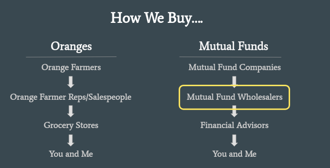
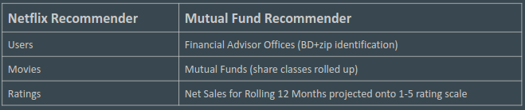
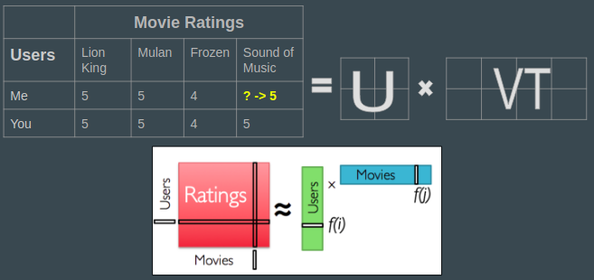
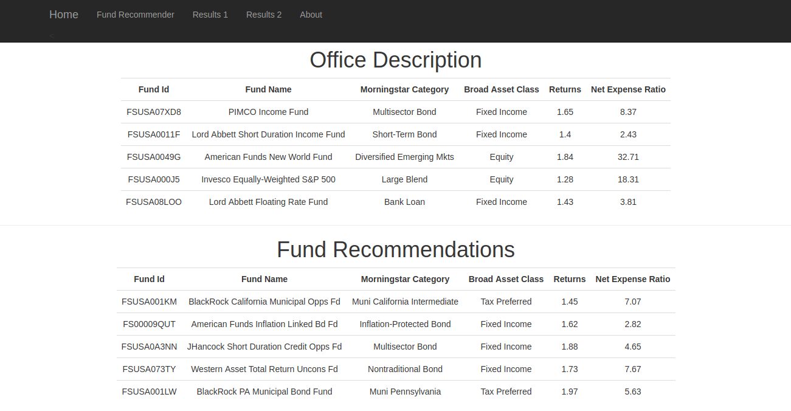

# Mutual-Fund-Recommender
Using historic sales and fund characteristics to recommend relevant mutual funds to financial advisors.

# Background

## Project Motivation

- Company: Strategic Insight
- Product: Local Market Share
- Purpose: Help mutual fund wholesalers to make more informed and targeted sales to financial advisors.
- Goal: Build a recommender model to suggest mutual funds that a given office is likely to buy

## Wholesaler-Driven Mutual Fund Selling Structure

## Recommender Model:

### A recommender you know and love: Netflix

    Netflix provides recommendations for movies to its users
    One of the methods it employs is collaborative filtering
    Idea: "People like you like this movie so we think you’ll like it too."
    Steps:
        1. Use ratings/preferences of similar users to predict what ratings you would give movies/tv shows
        2. Recommend the movies/tv shows with the highest predicted ratings

### Mutual Fund Recommender Components

### Collaborative Filtering through Matrix Decomposition

### WebApp

In order to be useful to mutual fund wholesalers who are pitching products to
financial advisors, this tool needs to be available on-the-go.

To facilitate that, I have created a flask app prototype.

## Welcome Page

## Choose the firm the advisor works for and the zip where they work.

## Results
The recommender returns the top funds currently selling in the office as well
as the top fund recommendations based on collaborative filtering.

